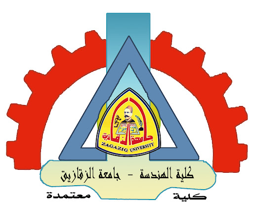
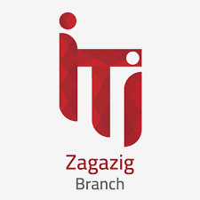

# G CAMP Competitions

  
  
  

    

Welcome to G CAMP Competitions! This event is designed to challenge your skills and creativity across multiple tracks. The competitions will take place over 3 days (Saturday, Sunday, and Monday) at Zagazig University and ITI Zagazig.

---

## Table of Contents
1. [Introduction](#introduction)
2. [Tracks and Projects](#tracks-and-projects)
3. [Competition Rules](#competition-rules)
4. [Judging Criteria](#judging-criteria)
5. [Prizes](#prizes)
6. [Submission and Presentation](#submission-and-presentation)
7. [Contact](#contact)

---

## Introduction
G CAMP Competitions offer participants the opportunity to showcase their talents in various fields. Whether you're into robotics, programming, data science, or e-commerce development, there's a track for you. The event will run for 3 days, with each track having its own unique challenges and evaluation criteria.

---

## Tracks and Projects
### 1. Robotics
- Project: Line Follower or Obstacle Avoidance.
- Evaluation Criteria: Speed, Accuracy, and Overall Performance.

### 2. Competitive Programming
- Format: Individual Problem-Solving Competition.
- Duration: 3 Hours.
- Evaluation Criteria: Number of Problems Solved within the Time Limit.

### 3. Data Science
- Team Size: 4 Members per Team.
- Project: Each team will work on a specific data science project.
- Evaluation Criteria: Accuracy, Innovation, and Data Analysis.

### 4. E-commerce Programming
- Includes: Frontend, Backend (PHP), Flutter, and UI/UX.
- Evaluation Criteria: Design, User Experience, and Project Performance.

---

## Competition Rules
- Participants must register for one track only.
- Teams for Data Science and E-commerce Programming must consist of 4 members.
- All projects must be submitted by the deadline.
- Participants must adhere to the code of conduct and respect all other participants and organizers.

---

## Judging Criteria
Projects will be judged based on the following criteria:
1. Innovation: How unique and creative is the solution?
2. Functionality: Does the project work as intended?
3. Design: Is the project well-designed and user-friendly?
4. Performance: How well does the project perform under given conditions?

---

## Prizes
- 1st Place: Cash Prize + Certified Certificate + Advanced Courses from Reputed Academies.
- 2nd Place: Cash Prize + Certified Certificate.
- 3rd Place: Certified Certificate.

---

## Submission and Presentation
- All projects must be submitted on the designated day.
- Each team will present their project individually to the judging panel.
- Presentations should clearly demonstrate the project's functionality, design, and innovation.

---

## Contact
For any questions or inquiries, please contact us at:
- Email: [Karamayaseen00@gmail.com]
- Phone: [01097102388]
---

## Attribution

 

 

 

This event is organized by GDG On Campus Zagazig, a non-profit organization focused on developing youth in various fields personally and technically through academic programs, projects, and events. You can find more information about GDG Zagazig at [Google.DSC.Zagazig](https://www.facebook.com/Google.DSC.Zagazig) |*-*-*-*| [GDG Developers Site](https://gdg.community.dev/gdg-on-campus-zagazig-university-zagazig-egypt/)

##

# 🎓 Graduation Project Bootcamp - Rulebook

## 📌 مقدمة
مرحبًا بكم في **Graduation Project Bootcamp**!  
يهدف هذا البوتكامب إلى تطوير مهارات المشاركين في مختلف المجالات التقنية من خلال العمل على مشاريع عملية والتنافس في مسابقات قوية لتحقيق التميز.  

## 📅 الجدول الزمني
- 🗓️ **المدة:** 3 أيام (السبت، الأحد، الاثنين)  
- ⏳ **التوقيت:** جميع التراكات تعمل في نفس الفترة الزمنية، باستثناء **مسابقة Competitive Programming** التي تستمر **3 ساعات فقط**.  

---

## 🔥 التراكات والمشاريع

### 1️⃣ Robotics Competition 🤖  
- **المشروع:** Line Follower أو Obstacle Avoidance  
- **التقييم بناءً على:**  
  - سرعة التنفيذ  
  - دقة الأداء  
  - استكمال المهام بنجاح  

---

### 2️⃣ Competitive Programming 🏆  
- **نوع المسابقة:** Problem Solving فردي  
- **⏳ المدة:** 3 ساعات  
- **التقييم:**  
  - عدد المسائل التي تم حلها بنجاح  

---

### 3️⃣ Data Science 📊  
- **التوزيع:** فرق مكونة من 4 أفراد  
- **التقييم بناءً على:**  
  - جودة تحليل البيانات  
  - الابتكار في الحلول  
  - دقة النتائج المقدمة  

---

### 4️⃣ E-commerce Programming 🛒  
- يشمل التراكات التالية:

  <strong>Frontend Development</strong>

  <strong>Backend (PHP)</strong>

  <strong>Flutter Development</strong>

  <strong>UI/UX Design</strong>

  
- **التقييم بناءً على:**  
  - جودة التصميم والتطوير  
  - تجربة المستخدم  
  - كفاءة وأداء المشروع  

---

## 🏅 نظام التقييم والجوائز  
- سيتم تقديم جميع المشاريع أمام لجنة التحكيم في يوم واحد.  
- كل **تيم يعرض مشروعه بشكل فردي** أمام اللجنة.  
- يتم تحديد الفائزين بناءً على المعايير المحددة لكل تراك.  

🏆 **أفضل 3 مراكز في كل مسابقة سيحصلون على:**  
- مكافآت مادية 💰  
- شهادات معتمدة 📜  
- كورسات قوية من أكاديميات متخصصة 🎓  

---

## 📜 القواعد العامة  
✔️ الالتزام بالأخلاقيات الأكاديمية والعمل الجماعي.  
✔️ يمنع استخدام أي وسائل غير قانونية في المسابقات.  
✔️ أي تلاعب أو مخالفة قد تؤدي إلى الاستبعاد من المسابقة.  
✔️ يجب تقديم المشاريع والانتهاء منها في الوقت المحدد.  

---

🚀 **نتمنى لكم تجربة رائعة ومليئة بالإبداع والإنجاز!**
